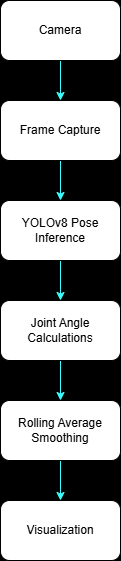
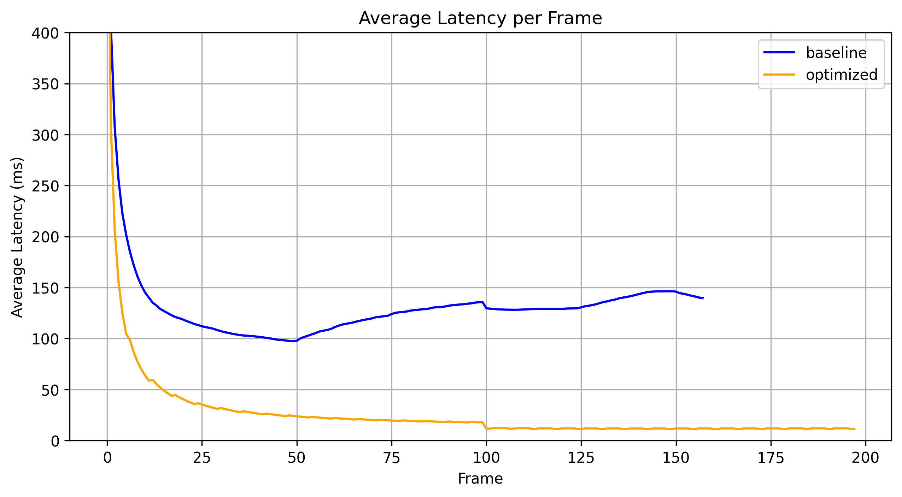
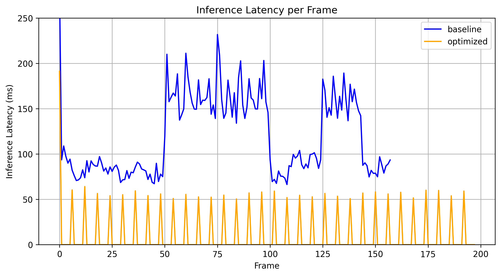

# pushup-professor

## Project Overview
**Pushup Professor** is a real-time computer vision application built with Python, OpenCV, and YOLOv8 Pose that performs webcam-based push-up detection using human pose estimation. The project includes performance instrumentation to profile execution time across each stage of the processing pipeline, identify runtime bottlenecks, and evaluate optimization strategies for real-time inference. 

Performance optimizations are configurable at runtime through command-line arguments, allowing different inference resolutions and frame-skipping strategies to be benchmarked without modifying the code.

Applying input resolution scaling together with configurable inference skipping reduced average end-to-end latency from 139.7 ms to 11.4 ms **(91.8%)** while preserving reliable real-time rep counting.

## Demo
<video src="./final.mp4" controls loop width="100%"></video>

## Pipeline Diagram

### Core Features
#### Computer Vision
* Real-time webcam inference
* YOLOv8 Pose estimation
* Joint-angle based push-up detection
* Rolling-average temporal smoothing

#### Performance Engineering
* Per-stage latency profiling
* Configurable inference resolution
* Configurable frame skipping
* CSV performance logging
* Benchmarking framework

### Technologies
* Python
* OpenCV
* Ultralytics YOLOv8 Pose
* NumPy
* Matplotlib
* Pandas

## Setup
Set up a Python venv and run `pip install -r requirements.txt`

## How to Run
Run `py main.py` with the following options:
* `--imgsz` --- sets the image size passed into the model for inference (default 640).
* `--skip-frames` --- how many frames to skip in-between running inference. For example, `--skip-frames 0` runs inference on every frame, while `--skip-frames 1` runs inference every other frame (default 0).
* `--log` --- toggles on logging capabilities.

## Performance Benchmarking
In order to quantify how much each improvement benefited performance, the code was run with different settings. Below is a discussion of that benchmarking.

### Benchmark Summary
|Configuration|Avg Latency (ms)|Std Dev Latency (ms)|Avg Inference Latency (ms)|% Runtime in Inference|
|---|---|---|---|---|
|640 px, inference every frame (Benchmark)|139.68|44.62|124.73|89.30|
|320 px, inference every frame|34.11|2.10|33.84|99.21|
|640 px, inference every other frame|36.16|34.39|31.74|87.78|
|640 px, inference every 6th frame|17.53|33.85|15.16|86.42|
|320 px, inference every other frame|19.08|16.80|16.69|87.47|
|320 px, inference every 6th frame|11.44|20.55|8.93|78.06|

Note: Metrics are computed over the last 100 frames to exclude one-time initialization overhead (e.g., model loading and camera warm-up) and better represent steady-state performance.

### Performance Evaluation

## Findings
* Inference accounted for approximately 90% of total pipeline execution time, making it the dominant performance bottleneck.
* Reducing the inference image size produced the largest latency improvement while maintaining reliable pose estimation for this application.
* Combining reduced input resolution with configurable inference skipping decreased average end-to-end latency from 139.7 ms to 11.4 ms **(91.8%)**.
* Temporal smoothing significantly improved rep-count stability while adding negligible computational overhead.